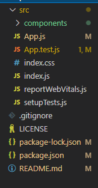
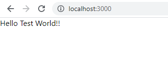
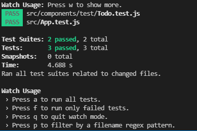

# React'a başlıyorum

Merhaba medium için yazdığım ilk makalemde benim de yeni başladığım React ile önyüz uygulaması geliştirmekten bahsedeceğim. React seçerken neler dikkatimi çekti, neyi ne için öğrenmem gerekti aktarmaya çalıştım. Yazının sonunda react'in template projesini oluşturacaksınız. Yaklaşık 15-20 dk süren bir süreç ile geliştirme ortamının hazır hale gelmiş olacak.

## React nedir?

React, Facebook tarafından geliştirilen açık kaynaklı bir önyüz geliştirme kütüphanesidir. Önyüz için bileşenler oluşturmamızı sağlar. HTML, CSS ve Javascript bilgisi kısa sürede önyüz bileşenleri geliştirmemizi sağlar.

## Neden React?

Öncelikle açık kaynaklı olması ve arkasında Facebook dahil güçlü bir community'nin olması iyi bir seçenek. Ancak kendi adıma, HTML, CSS ve Javascript ile bilgimiz mevcutsa hızlı bir şekilde React ile uygulama geliştirmeye başlayabilmemiz, öğrenmenin hızlı olması da bir seçenek (**_JSX_**).

React'ın performans olarak data değiştiğinde bileşen bazlı olarak render olmasından kaynaklı hızı da bir tercih sebebi.

React, ata bileşenden alt bileşenlere doğru bir data akışı vardır ve alt bileşenden ata bileşene doğru event ile durum değişiklikleri iletilir(**_Single way data flow_**).


Figure 2.1

React, data değişikliklerini bileşenlerine yansıtmak için in-memory veri yapısı kullanır(**_Virtual Data Object Model_**). Yapılan değişiklikler böylece sadece datası değişen bileşenlerin güncellenmesini sağlar.

## React ile uygulama geliştirme - bebek adımları

Ufak bir bilgilenmeden sonra artık aksiyona geçmemiz gerekiyor. React'ın bizim için hazırlanmış template projesini oluşturarak başlayabiliriz. Ancak öncesinde geliştirme ortamımızı hazırlamamız gerekiyor.

### Node.js ve npm kurulumu

node.js ve npm React uygulamamızı çalıştırmak ve build almak için kullanacağımız komut satırı araçları.

node.js bizim için javascript uygulamalarını (React'ta bir javascript uygulaması) browser dışında çalıştırmamızı sağlar. [NodeJS](http://nodejs.org) üzerinden kurulumu yapabilirsiniz.

npm de kullanacağımız javascript paketlerini node kullanarak download etmemizi sağlayan araçtır.


Figure 2.1

Kurulumu gerçekleştirdikten sonra aşağıda ki komut ile kontrol edebilirsiniz.

```
node -v
npm -v
```

### Versiyon kontrol sistemi - git kurulumu

Projenin başlangıcından itibaren git ile versiyonlamanızın projenin ilerlemesini takip etmenizde büyük yararı olacaktır.

[git](https://git-scm.com/downloads)

### Geliştirme Arayüzü - Visual Studio Code

Geliştirme arayüzü olarak Visual Studio Code kullanıyorum.
[Visual Studio Code](https://code.visualstudio.com/)

## React ilk uygulama

Eh artık herşeyimiz hazırsa geliştirmeye başlayabiliriz. Aslında bundan sonrasında ilk projenin oluşturulmasını node üzerinden hazır bir template oluşturan paket yapacak. :)

```
npx create-react-app react-boilerplate
cd react-boilerplate
```

Kurulum gerçekleştikten sonra folder yapısı aşağıda ki gibi olur.


```json
...
 "dependencies": {
    "react": "^17.0.2",
    "react-dom": "^17.0.2",
    "react-scripts": "4.0.3",
    "web-vitals": "^1.1.2"
  },
  "scripts": {
    "start": "react-scripts start",
    "build": "react-scripts build",
    "test": "react-scripts test",
    "eject": "react-scripts eject"
  },
  "eslintConfig": {
    "extends": [
      "react-app",
      "react-app/jest"
    ]
  },
  "devDependencies": {
    "@testing-library/react": "^11.2.7",
    "@testing-library/jest-dom": "^5.14.1",
    "@testing-library/user-event": "^12.8.3"
  }
  ...
```

**_package.json_** projemizin genel bağımlılıklarını içerir. ayrıca scripts sekmesinin altında da projeyi komut satırından çalıştırırken kullanabileceğimiz kısa yolları ekleyebiliriz.

- **_react-dom_** DOM'a özel methodları içerir. index.js içinde render methodu uygulamamızı DOM'a yazmak için kullanılır.
- **_react-scripts_** script ve konfigurasyonları içerir.

**\*node-modules** package.json içinde yer alan bütün bağımlılıkları içerir.

**_public_** webserver'in ilgileneceği root dizin burasıdır. index.html aslında erişilir. `index.html` sayfasında yer alan ` <div id="root"></div>` bizim için önemlidir. Ayrıca css, metatags ve icon'lar burada yer alır. `manifest.json` dosyasıysa uygulama ile ilgili genel bilgileri içerir. Mesela mobil bir telefonda kısa yol olarak eklenirsek icon, text vs bilgileri buradadır.

**_src_** dizininde asıl react uygulaması buradadır. Yani asıl kodumuzuda buraya yazacağız. `index.js` içinde inde.html de belirttiğimiz DOM'daki `root` element'e erişmemizi sağlar. `<App />` ise bizim ilk react bileşenimizdir.

```javascript
ReactDOM.render(
  <React.StrictMode>
    <App />
  </React.StrictMode>,
  document.getElementById('root'),
);
```

Artık ilk uygulama hakkında bilgilerimizi edindiğimize göre bakalım bize template ne oluşturmuş.

```
npm start
```


Bu aşamadan sonra artık uygulamaya bir browser üzerinden bağlanılabilir.(start işlemi sonrasında default tanımlı browser ile uygulama otomatik açılır). Bu template projede react uygulamasını ayağa kaldırmış ve geliştirme yapmaya hazırlamış oluyoruz.


# Birim Test entegrasyonu yapalım?

Birim testin ne kadar önemli olduğunu hepimizin bildiğini düşünüyorum. Ancak ya geneld projelerde kullanılamıyabiliyor. Bu genelde şirket kültüründen kaynaklı oluyor diye düşünüyorum. Ancak bu boilerplate proje için kültürü kendim belirlediğimden bunu öncelikle koymak istiyorum. Bundan sonrasında da elimden geldiğince yazdığım kodlara unittest ekleyerek yazmak niyetindeyim. Umarım başarılı olurum.

## Neden birim testi yazmalıyız?

Birim testi aslında geliştiricinin kendi yazdığı fonksiyonun düzgün çalışıp çalışmadığını test ettiği, sonradan bu fonksiyonun güncellenmesi durumunda, kişinin nelere dikkat etmesi gerektiğini söyleyebileceği yerdir. Bir dokümanda bütün durumları yazmak yerine kod içinde bulunması geliştiriciyi aslında güvenli bir noktaya alır diyebiliriz. Ortalam %70-%80 civarında olan bir test kapsaması yeterli olacaktır. Tabii daha iyisini yapabilirsek neden yapmayalım.

Peki birim testinin bize faydaları neler olacaktır.

- Uygulama ve/veya test ettiğimiz fonksiyon özelinde bir hatayı en hızlı şekilde anlarız.

- Diğer komplex testlere göre(fonksiyonel, entegrasyon, end2end ya da manuel) daha az efor harcarız.

- Hata alındığı zaman olarak hangi durumda ve neden hata aldığını belirleriz.

Birim testi neden yaptığımızı belirtiğimize göre artık ortamımızı hazırlayabiliriz.

Öncelikle react template'i oluşturduğumuz zaman bizim için `React Testing Library` ve `Jest` package.json içinde hazır olarak gelecek. Ben bunu değiştirmek istemiyorum.

[`React Testing library`](https://github.com/testing-library/react-testing-library) , `DOM Testing Library` üzerine kurulmuş ve React bileşenleri ile çalışması için API'ler eklenmiş olarak geliyor. Bu kütüphane bize React bileşenlerini test edebilmemiz için react-dom üzerinde kullanabileceğimiz fonksiyonlar sağlar.

[`Jest`](https://jestjs.io/) ise bizim için `jsdom` ile DOM'a erişebileceğimiz JavaScript test koşumunu sağlayacak araçtır. jsdom bir nevi browser üzerinde çalışacakmış gibi react bileşenlerimizi çalıştırmaya yarayacak.

Geliştirmeye aşlamadan önce dizin yapısı aşağıda ki gibi olacak şekilde temizledim.



İkinci olarak oluştumak istediğim bileşeni `components` dizinin altına oluşturuyorum.

```javascript
import React from 'react';

function Todo() {
  return <div>Hello Test World!!</div>;
}

export default Todo;
```

Oluşturduğum bileşeni `App.js` içinde kullanıyorum.

```javascript
import Todo from './components/Todo';

function App() {
  return (
    <div>
      <Todo />
    </div>
  );
}
export default App;
```

Uygulamayı çalıştırdığım (`npm run start`) zaman aşağıda ki resimde ki gibi sadece **Hello Test World!!** yazan bir beyaz ekran çıkacak.



Test sınıflarını ilgili bileşenin olduğu dizinde oluşturuyorum. Dizin adını da `test` olarak belirliyorum. İçine de standart olarak <bileşenin adı>.test.js `Todo.test.js` olarak belirliyorum. Jest test için okulan dosyaları `.test.js` regex'i ile tanıyacak. Bu yüzden test dosya adını bu şekilde belirliyoruz.

Ve test içeriğimizi basitçe belirledik. Artık test yazabiliriz. Aşağıdaki testleri [`Jest`](https://jestjs.io/docs/getting-started) sitesinden aldım. Jest ile test yazmak için buradan yararlanabilirsiniz. Oldukça güzel bir dokümantasyonu mevcut.

```javascript
test('iki artı iki dört', () => {
  expect(2 + 2).toBe(4);
});

test('nesne testi', () => {
  const data = { one: 1 };
  data['two'] = 2;
  expect(data).toEqual({ one: 1, two: 2 });
});
```

Artık testimizi yazdığımıza göre çalıştırabiliriz.

```
npm run test
```

App.test.js template proje içinde yer alan bir testti ve içini temizledim. Toplam test sayısı ve test suite yani bir nevi senaryo sayısı detay olarak gösteriliyor.



Artık bileşenimizin gerçek testini yazmaya başlayabiliriz.

Öncelikle react bileşenimizi test edebilmek için react-testing-library içinde yer alan ve bizim için gerekli üç önemli fonksiyonu import edelim.

```javascript
import { screen, render, cleanup } from '@testing-library/react';
import Todo from '../Todo';
```

ve ilk test metodumuzu yazalım. Öncelikle **render** methodu ile bileşenimizi DOM'a atalım. Ardından **screen** objesinde yer alan **getAllByTestId** fonksiyonunu kullanarak istediğimiz render edilen elementin içinde ki id'si `todo-item` olan elementi almamızı sağlar. Jest içinde yer alan `toBeInTheDocument` methodu ile de element'in DOM'da olup olmadığına bakabiliriz.

`testing-library/react` içinde yer alan fonksiyonları [`Jest Cheatsheet`](https://testing-library.com/docs/dom-testing-library/cheatsheet) sitesinden bakabilirsiniz..

```javascript
test('should render Todo Component', () => {
  render(<Todo />);
  const element = screen.getByTestId('todo-item');
  expect(element).toBeInTheDocument();
});
```

Testimiz çalıştığı zaman ` TestingLibraryElementError: Unable to find an element by: [data-testid="todo-item"]` diye bir hata alacağız. Bunu düzeltmek için Todo bileşenini değiştirelim.

```javascript
import React from 'react';

function Todo() {
  return <div data-testid='todo-item'>Hello Test World!!</div>;
}

export default Todo;
```

Tabi Todo ileşenimiz de **todo-item** id'li bir element bulunmadığı için öncelikle hata verecek. Bu yüzden önce onu ekleyelim. Testimizi hata vermeden çalışacaktır.

```
 PASS  src/App.test.js
 PASS  src/components/test/Todo.test.js

Test Suites: 2 passed, 2 total
Tests:       2 passed, 2 total
Snapshots:   0 total
Time:        6.381 s
Ran all test suites related to changed files.

Watch Usage: Press w to show more.
```

Artık bileşenimize gelecek parametrelerle ilgili testler yapabiliriz. Bileşenimiz `Hello Test World!!` yerine parametre olarak aldığı değeri yazan bir bileşen olsun.

```javascript
...
function Todo({ text }) {
  console.log(text);
  return (
    <div data-testid='todo-item' id='todo-id'>
      {text}
    </div>
  );
}
...
```

**NOT:** DOM Testin Library içinde ...ByTestId fonksiyonları `data-testid` attribute ismini kullanarak işlem yapar. Bu ismi değiştirmek için `configure({testIdAttribute: 'data-my-test-attribute'})` yapmak gerekiyor.

Artık testlerimiz yine fail etti. Bu durumda testimizi güncellemek gerekecek. Artık bileşenimiz text isimli bir property değerini dışarıdan aldığı için testimizi düzenleyelim. Ve artık bileşenimiz gelen text değeri neyse onu göstermesi gerekiyor o yüzden `toHaveTextContent` fonksiyonu ile bunu kontrol edebiliriz.

```javascript
test('should render Todo Component', () => {
  const text = 'Hello Test World!!!';
  render(<Todo text={text} />);
  const element = screen.getByTestId('todo-item');
  expect(element).toBeInTheDocument();
  expect(element).toHaveTextContent(text);
});
```

Native Javascript ile elemente ulaşmak için aşağıda ki testi kullanabiliriz. document içinde ki fonksiyonları da kullanarak elementlere erişebiliriz.

```javascript
test('should render Todo Component as native', () => {
  const text = 'Hello Test World!!!';
  render(<Todo text={text} />);
  const element = document.getElementById('todo-id');
  expect(element).toBeInTheDocument();
  expect(element).toHaveTextContent(text);
});
```
